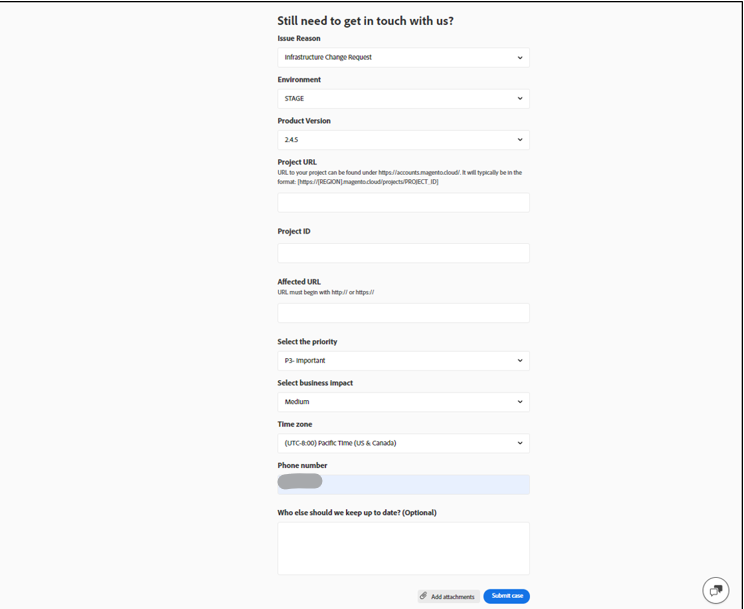
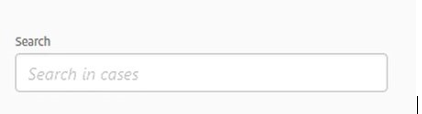

# Användarhandbok för Adobe Commerce Help Center

Läs om hur du skickar en supportanmälan till [Adobe Commerce Help Center](https://support.magento.com/hc/en-us) och ger delad åtkomst till Adobe Commerce-konton.

>[!NOTE]
>
>Adobe Commerce support går från Adobe Commerce Help Center till Experience League. Om du har fått ett meddelande om att du har åtkomst använder du det formulärflöde för Experience League som beskrivs [här](#what-is-experience-support). Om du inte har fått något meddelande kan du fortsätta använda [Adobe Commerce Help Center Case flow](#what-is-adobe-commerce-help-center).

>[!NOTE]
>
>Kunskapsbasen i Adobe Commerce Help Center har migrerats till Adobe Experience League-portalen. När du skapar en supportanmälan visas tillhörande artiklar i kunskapsbasen tillsammans med annan relevant Adobe Commerce-dokumentation från Adobe Experience League.

**Viktig uppdatering:** 8 juli 2024

**[VAD STÖDER EXPERIENCE LEAGUE?](#what-is-experience-support)**

**[SUPPORTÄRENDEN](#support-cases)**

* [Logga in på Experience League Support](#sign-in-experience-support)
* [Skicka ett supportärende](#submit-case)

   * [Adobe Experience League startsida](#experience-league-start-page)
   * [Adobe Commerce kontosida](#submit-case-adobe-commerce-account-page)
   * [*Verifiera din e-postadress*](#verify-email-address-error)

* [Spåra era supportärenden](#track-support-cases)
* [Kommentarer](#comments-in-your-case)
* [Stäng ärendet](#close-case)

**[VAD ÄR ADOBE COMMERCE HELP CENTER?](#what-is-adobe-commerce-help-center)**

**[STÖDTICKETS](#support-tickets)**

* [Logga in på Help Center](#login)
* [Skicka en supportanmälan](#submit-ticket)

   * [Startsida för Help Center](#submit-ticket-help-center-start-page)
   * [Magento-kontosida](#submit-ticket-magento-account-page)
   * [Cloud Console](#submit-ticket-magento-cloud-account-page)
   * [Information i din supportanmälan](#info-in-support-ticket)
   * [Länken Skicka en biljett visas inte på startsidan för Adobe Commerce Help Center](#no-submit-link)
   * [*&quot;Verifiera din e-postadress&quot;*](#verify-email-address)
   * [Formulär för att skicka biljetter: handlaren visas inte i den nedrullningsbara listan Organisation](#merchant-not-displayed)

* [Spåra era biljetter](#track-tickets)
* [Adobe Commerce P1 hotline (inloggning krävs)](#P1-hotline)
* [Operativmodellen Adobe Commerce Shared Responsibility (inloggning krävs)](#shared-responsibility-operational-model)
* [Förklaring av supportbiljettfält](#ticket-fields-explained)
* [Biljettstatus: Hur dina förfrågningar behandlas](#ticket-status)
* [Samtal i din biljett](#conversation-in-ticket)
* [Lös din biljett](#resolve-ticket)
* [Öppna en uppföljningsbiljett](#follow-up)

**[DELAD ÅTKOMST: BEHÖRIGHET FÖR ANDRA ANVÄNDARE ATT FÅ ÅTKOMST TILL DITT KONTO](#shared-access)**

* [Vem kan ge delad åtkomst?](#who-can-provide-shared-access)
* [Ge delad åtkomst](#provide-shared-access)
* [Återkalla (ta bort) delad åtkomst](#revoke-shared-access)

   * [Hur tar jag bort användare som beviljats delad åtkomst via ett Cloud-projekt?](#remove-cloud-shared-access-users)

* [Åtkomst till delat konto (växlingskonton)](#switch-accounts)
* [Felsökning av delad åtkomst](#troubleshooting-shared-access)

**[FAKTURERINGSFRÅGOR FÖR ADOBE COMMERCE](#billing-faq)**

**[MAGENTO U INGÅR NU I ADOBE DIGITALA LÄRNINGSTJÄNSTER](#magento-u)**

>[!NOTE]
>
>Om du inte har fått något meddelande fortsätter du använda [Adobe Commerce Help Center-ärendeflödet](#what-is-adobe-commerce-help-center). Om du har fått ett meddelande om att du är i kohorten med åtkomst följer du det formulärflöde för Experience League-fall som beskrivs [nedan](#what-is-experience-league-support).

## VAD STÖDER EXPERIENCE LEAGUE? {#what-is-experience-support}

Experience League Support är en supportportal för Adobe där Adobe Commerce-kunder kan skicka in och hantera supportärenden. Här kan du även läsa felsökningsartiklar.

## STÖDFALL {#support-cases}

Med Adobe Experience League Support Case Management kan man arbeta med support genom olika ärenden för att åtgärda specifika problem som uppstår när man använder Adobe-produkter, inklusive Adobe Commerce, för alla Adobe Commerce-produkter som omfattas av avtal.

## LOGGA IN PÅ STÖD FÖR EXPERIENCE LEAGUE {#sign-in-experience-support}

Om du loggar in kan du skicka, uppdatera och besvara frågor från agenter på supportärenden.

Så här loggar du in på Adobe Experience League Support:

1. Navigera till [experience.adobe.com](https://experienceleague.adobe.com/).
1. Logga in med inloggningsuppgifterna för Adobe.

### Skicka ett supportärende {#support-case}

När du har loggat in kan du skicka in ett supportärende via Adobe Experience League hemsida, din Adobe Commerce-kontosida och din kontosida för Adobe Commerce Cloud.

* Om du är kontoägare följer du stegen nedan.
* Om du är en delad åtkomstanvändare måste du först växla konton. Se [Åtkomst till delat konto (växlingskonton)](https://experienceleague.adobe.com/en/docs/commerce-knowledge-base/kb/help-center-guide/magento-help-center-user-guide#switch-accounts) och fortsätt sedan med stegen nedan.

#### Adobe Experience League startsida {#experience-league-start-page}

Så här skickar du ett nytt supportärende från Adobe Experience League startsida:

>[!NOTE]
>
>1. Om du tillhör flera organisationer måste du välja lämplig organisation i listrutan.
>1. Du måste ha rätt till support för att kunna lämna in ett ärende. Om du inte gör det visas ett fält högst upp på sidan som informerar dig om att du inte är en supportberättigad användare i organisationen.

1. Klicka på **Support** i sidhuvudet. Då öppnas supportens hemsida.

   

1. Klicka **[!UICONTROL Open Ticket]** på den vänstra menyn eller klicka **[!UICONTROL Get Started]** i *[!UICONTROL Open a support ticket]*-kortet för att starta supportinhämtningen.

   

1. Välj en produkt i listrutan och ange en falltitel och beskrivning.

   

1. Adobe Experience League kommer att föreslå artiklar och bästa praxis som kan hjälpa dig att lösa ditt ärende. Om du fortfarande behöver direktsupport måste du ange ytterligare information innan du skickar in ärendet.

   

1. När du har fyllt i all nödvändig information klickar du på **[!UICONTROL Submit case]**.

Du måste ha ett konto på både https://account.adobe.com och https://account.magento.com för att kunna logga in på Experience League och skicka in ett supportärende. Du kan inte skicka in ett supportärende förrän du är inloggad.

>[!NOTE]
>
>Om du redan har ett konto på https://account.magento.com, men inte kan logga in, kanske du inte har registrerat dig för ett konto på https://account.adobe.com, vilket krävs från och med augusti 2022.
>
>Så här löser du det:
>1. Skapa ett konto på https://account.adobe.com med samma e-postadress på ditt MAG-ID.
>1. Gå till https://account.magento.com om du vill länka din Adobe ID till ditt MAG-ID.

#### Adobe Commerce kontosida {#submit-case-adobe-commerce-account-page}

Så här skickar du en ny supportanmälan på din Adobe Commerce-kontosida:

1. Logga in på ditt Adobe Commerce-konto. Se [detaljerade instruktioner](https://experienceleague.adobe.com/docs/commerce-admin/start/commerce-account/commerce-account-create.html?lang=en#create-a-commerce-account) i vår användarhandbok.
1. Klicka på fliken **Support**.

   {width="800"}

1. Adobe Experience League supportsida visas.
1. Välj **[!UICONTROL Open Ticket]** på den vänstra menyn.
1. Fyll i fälten.
1. Klicka på **Skicka**.

#### *Verifiera din e-postadress*-fel på Adobe Commerce-kontosida {#verify-email-address-error}

Du kan inte skicka in en supportanmälan om du får felmeddelandet Kontrollera din e-postadress som liknar den nedan på sidan [Adobe Commerce-konto](https://account.magento.com/).

### Spåra era supportärenden {#track-support-case}

Dina supporttillfällen är sådana som du har:

* har lämnat in personuppgifter.
* har lagts till som en bevakare via en CC (kopia).

#### Visa dina ärenden

Du kan visa dina ärenden genom att klicka på **[!UICONTROL My Cases]** på den vänstra menyn.

#### Sök efter ärenden

Om du vill söka efter fall skriver du din sökfråga i fältet *[!UICONTROL Search]* och trycker på *enter* på tangentbordet.

#### Eskalera dina ärenden

Om du känner att ett fall kräver ytterligare uppmärksamhet och att vår initiala svarstid har passerat, kan du eskalera fallet. För att göra det,

1. Klicka på **[!UICONTROL Escalate to management]** längst ned till höger på panelen *[!UICONTROL Case Detail]* till höger på skärmen.

   

1. När du har klickat visas ett popup-formulär. Fyll i formuläret och klicka sedan på **[!UICONTROL Escalate]**.

   

   *Orsaker till eskalering kan vara*: Agentkommunikationskunskaper, Agentens tekniska kunskap, Väntar på återanrop/uppdatering, Ändring i problemnödläge, Upplösningen uppfyllde inte förväntningarna eller Tid till lösning.

#### Lägg till en bevakare i supportärenden

Du kan lägga till bevakare för supportärenden som skickats in av medlemmar i din organisation. Tittarna får e-postmeddelanden när nya ärenden skickas eller när befintliga ärenden uppdateras.

1. Om du vill lägga till en bevakare i ett befintligt ärende öppnar du skiftläget och klickar på pennikonen bredvid &quot;bevakare&quot; på panelen Skiftinformation till höger på skärmen.

   

1. När du har klickat på pennan kan du lägga till eller ta bort bevakare från listan.

   

### Kommentarer {#comments-in-your-case}

Kommentarerna i ditt ärende innehåller alla kommentarer som skrivits av dig eller Adobe Commerce supportteam. Kommentarerna visas från den senaste (överst) till den tidigaste (nederst).
Så här lägger du till en kommentar:

1. Rulla längst ned på biljetten.
1. Skriv din kommentar i fältet **[!UICONTROL Comments]** och klicka på **[!UICONTROL Add comments]**.

### Stäng ärendet {#close-case}

Om du vill stänga ditt ärende klickar du på **[!UICONTROL Close case]** längst ned till höger på panelen *[!UICONTROL Case Detail]*.

>[!NOTE]
>
>Fortsätt att använda formulärflödet [nedan](#what-is-adobe-commerce-help-center) i Adobe Commerce Help Center för att skicka och hantera biljetter, såvida du inte har fått ett meddelande om att du är i kohorten med åtkomst till formulärflödet för Experience League-ärenden som beskrivs [här](#what-is-experience-league-support).

## VAD ÄR ADOBE COMMERCE HELP CENTER? {#what-is-adobe-commerce-help-center}

[Adobe Commerce Help Center](https://support.magento.com/hc/en-us) är en supportportal för Adobe Commerce där kvalificerade kunder kan skicka in och hantera supportärenden. Här kan du även läsa felsökningsartiklar.

## STÖDTICKAR {#support-tickets}

Med Adobe Commerce Ticketing System kan du arbeta med supportärenden för att åtgärda just de problem du upplever när du arbetar med Adobe Commerce - för alla Adobe Commerce-produkter.

## LOGGA IN PÅ HJÄLP CENTER {#login}

Med inloggning kan du skicka, uppdatera och besvara frågor från agenter på supportärenden.

Så här loggar du in på Adobe Commerce Help Center:

1. Gå till hjälpcentret på <https://support.magento.com>.
1. Klicka på **Logga in** längst upp till höger.

Logga in med autentiseringsuppgifterna för ditt Magento-konto. Mer information finns i [Ditt Magento-konto](https://experienceleague.adobe.com/docs/commerce-admin/start/commerce-account/commerce-account-create.html) i användarhandboken.

### <strong>Skicka in en supportanmälan</strong> {#submit-ticket}

När du har loggat in kan du skicka in en supportanmälan via hjälpcentrets startsida, din kontosida för Magento och din kontosida för Magento Cloud.

* Om du är **kontoägare** följer du stegen nedan.
* Om du är en **delad åtkomstanvändare måste du först växla konton** [få åtkomst till delat konto (växlingskonton)](#switch-accounts) och sedan kan du fortsätta med stegen nedan.

#### Startsida för Help Center {#submit-ticket-help-center-start-page}

Så här skickar du en ny supportanmälan på startsidan i Adobe Commerce Help Center:

1. Gå till [Adobe Commerce Help Center](https://support.magento.com/hc/en-us).
1. Klicka på **Skicka en biljett** i det övre högra hörnet.

   {width="800"}

1. Fyll i fälten.
1. Klicka på **Skicka**.

Du *måste ha* ett konto på både https://account.adobe.com och https://account.magento.com och sedan logga in på Help Center med ditt Adobe Commerce-konto för att skicka in en supportanmälan. [Knappen **Skicka en biljett** visas inte förrän du är inloggad](#no-submit-link).

>[!NOTE]
>
>Om du redan har ett konto på https://account.magento.com, men inte kan logga in, kanske du inte har registrerat dig för ett konto på https://account.adobe.com, vilket krävs från och med augusti 2022.
>
>Så här löser du det:
>
>1. Skapa ett konto på https://account.adobe.com med samma e-postadress på ditt MAG-ID.
>1. Gå till https://account.magento.com om du vill länka din Adobe ID till ditt MAG-ID.

#### Magento-kontosida {#submit-ticket-magento-account-page}

Så här skickar du en ny supportanmälan på din kontosida i Magento:

1. Logga in på ditt Magento-konto. Se [detaljerade instruktioner](https://experienceleague.adobe.com/docs/commerce-admin/start/commerce-account/commerce-account-create.html?lang=en#create-a-commerce-account) i vår användarhandbok.
1. Klicka på fliken **Support**.

   {width="800"}

1. Startsidan för Help Center visas.
1. Klicka på **Skicka en biljett** i det övre högra hörnet.
1. Fyll i fälten.
1. Klicka på **Skicka**.

#### Cloud Console {#submit-ticket-magento-cloud-account-page}

Så här skickar du en ny supportanmälan via molnkonsolen:

1. Logga in på [molnkonsolen](https://console.adobecommerce.com).
1. Välj **[!UICONTROL Support]** på användarmenyn.
1. Sidan **[!UICONTROL My Tickets]** visas.
1. Klicka på **[!UICONTROL Submit a ticket]** i det övre högra hörnet.
1. Fyll i fälten.
1. Klicka på **Skicka**.
1. Klicka på **[!UICONTROL Submit]**.

#### Information i din supportanmälan {#info-in-support-ticket}

Fälten, markerade med en röd asterisk ( **\*** ), är obligatoriska och måste fyllas i. Om du lämnar något av dessa fält tomt kan du inte skicka in din biljett.

Mer information finns i [Biljettfält som förklaras](#ticket-fields-explained) nedan.

### Länken Skicka en biljett visas inte på startsidan för Adobe Commerce Help Center {#no-submit-link}

#### Problem

Du kommer åt Adobe Commerce Help Center och vill skicka en supportförfrågan, men länken **Skicka en anmälan** visas inte på hjälpcentrets startsida.

#### Orsak

Orsaken kan vara något av följande:

* Du har inte loggat in på Help Center.
* Om du använder delad åtkomst för första gången har du inte utfört de steg som krävs för att säkerställa att Adobe Commerce Help Center har konfigurerats korrekt via SSO-anropet från Magento.com.
* Ditt konto har inte rätt till Adobe Commerce support (du är till exempel inte betalande Commerce-kund eller Open Source-kund).

#### Lösning

[Logga in på Help Center](/help/help-center-guide/help-center/magento-help-center-user-guide.md#provide-shared-access).

Länken **Skicka en biljett** visas bara för kunder med ett e-postmeddelande som är länkat till ett giltigt supportavtal.

#### Använda konto för delad åtkomst

Om du vill kunna använda kontot för delad åtkomst för att skicka supportärenden måste du göra följande (detta behöver bara göras en gång):

1. När du har fått [delad åtkomst](https://support.magento.com/hc/en-us/articles/360052444712#who-can-provide-shared-access) loggar du in på ditt [Magento-konto på magento.com ](https://account.magento.com/).
1. Välj kontot för delad åtkomst i listrutan **Byt konto** i det övre högra hörnet.
1. Klicka på fliken **Support** i den vänstra panelen. På så sätt ser du till att Adobe Commerce Help Center är korrekt konfigurerad via SSO-anropet från Magento.com till Adobe Commerce Help Center.

#### Hittar fortfarande inte länken **Skicka en biljett**

Om du inte har **Delade konton** i listrutan **Byt konto**, men du arbetar för en klient som har en Adobe Commerce-licens, ber du dem att ge dig delad åtkomst. Mer information finns i [Ge delad åtkomst till Magento-kontot](/help/help-center-guide/help-center/magento-help-center-user-guide.md#provide-shared-access).

Om du äger en Adobe Commerce-licens kontrollerar du att du inte har någon faktura med statusen **Väntande betalning**. Supportberättiganden beviljas automatiskt eller återkallas enligt fakturabetalningsstatus.

Så här kontrollerar du betalningsstatus:

1. Logga in på [magento.com](https://support.magento.com/).
1. Klicka på **Faktureringshistorik** till vänster.
1. Om du **do** har en faktura med statusen **Väntande betalning**, **kontaktar du ditt Adobe-kontoteam** för att få betalningsproblemet löst.

Vi ger support endast till Adobe Commerce licensägare och konton som har delad åtkomst till ett konto med en Adobe Commerce-licens. Om du behöver support för Magento Open Source kan du använda dessa självhjälpsresurser:

* [Adobe Commerce Help Center](https://support.magento.com/)
* [Adobe Commerce Developer Documentation](https://developer.adobe.com/commerce/docs/)
* [Adobe Commerce dokumentationsresurser](https://experienceleague.adobe.com/docs/commerce.html)
* [Magento forum](https://community.magento.com/?_ga=2.99592990.1084044056.1559046120-720752292.1551793747)

Om du har problem med att logga in på ditt konto eller tror att Delad åtkomst har konfigurerats korrekt, men du fortfarande inte kan se knappen **Skicka en biljett**, skicka ett e-postmeddelande med [Hjälpcentrets inloggningsproblem](mailto:grp-magento-helpcenterloginissues@adobe.com). Vi granskar gärna dina kontoinställningar och dina supportberättiganden.

>[!NOTE]
>
>Om du har problem med att få åtkomst till ditt molnprojekt skickar du biljetten för det här problemet via de vanliga kanalerna. Skicka inte e-post om du kan skicka en biljett.

### Felmeddelandet &quot;Verifiera din e-postadress&quot; på Magento-kontosidan {#verify-email-address}

Du kan inte skicka in en supportanmälan om du får felet *Verifiera din e-postadress* som liknar felet nedan på [Magento-kontosidan](https://account.magento.com/).

{width="800"}

Lösningen är att validera din e-postadress:

1. Logga in på https://account.adobe.com och begär ett lösenord om det behövs.
1. Verifiera ditt Adobe-konto.

>[!NOTE]
>
>Detta gäller endast för e-postvalideringslänken från https://account.magento.com (Magento-kontosida).

### Formulär för att skicka biljetter: handlaren visas inte i den nedrullningsbara listan Organisation {#merchant-not-displayed}

#### Problem

Förutsättningar: Du har ett konto för delad åtkomst som tilldelats av en handlare.

Steg som ska återskapas:

1. Logga in på Help Center med ditt delade konto.
1. Klicka på länken **Skicka en biljett**. Formuläret för anmälan av biljett öppnas.
1. Expandera listrutan **Organisation** och välj handlare.

Förväntat resultat:

Handlaren som motsvarar det delade kontot visas i listan med alternativ för **organisation**.

Faktiskt resultat:

Handlaren som motsvarar det använda delade kontot är inte tillgänglig i alternativen för **organisationen**.

#### Lösning

Efter att ha beviljats delad åtkomst från handlaren måste du vidta följande åtgärder (endast en gång):

1. Logga in på ditt [Magento-konto på magento.com](https://account.magento.com/).
1. Välj kontot för delad åtkomst i listrutan **Byt konto** längst upp till höger.
1. Klicka på fliken **Support** i den vänstra panelen. På så sätt ser du till att Adobe Commerce Help Center är korrekt konfigurerad via SSO-anropet från Magento.com till Adobe Commerce Help Center.

Om du redan har gjort detta kontrollerar du om du har beviljats *delad åtkomst från mer än en handlare* genom att klicka på fliken [[!UICONTROL Shared with me] på ditt konto](https://account.magento.com/grantor/manage/shared/):
* Om bara en [!UICONTROL Share Name] anges, d.v.s. du bara har beviljats av en handlare, *visas inte en [!UICONTROL Organization]-listruta*.
* Om det finns flera [!UICONTROL Share Names] kan handlarens supportberättiganden ha gått ut eftersom deras licens tidigare återkallats på grund av betalningsproblem.

### Spåra era biljetter {#track-tickets}

Det är biljetter du får:

* har lämnat in personuppgifter
* har lagts till som bevakare via en CC (kopia)

#### Visa dina biljetter

Om du vill visa alla dina biljetter klickar du på din profilmeny (övre högra hörnet) på hjälpcentrets startsida och väljer **Mina biljetter**.

{width-&quot;800&quot;}

Klicka på motsvarande flik för att växla mellan dina biljetter och de biljetter du har fått en kopia av:

* **Mina biljetter**
* **Biljetter jag är CC&#39;d på**
* **Organisationsbiljetter** (tillgängligt om ditt konto är kopplat till flera organisationer)

Om du vill sortera biljetter klickar du på kolumnrubrikerna **Skapad** eller **Senaste aktivitet** .

#### Sök efter biljetter

Om du vill hitta biljetter skriver du din sökfråga i fältet **Sökbiljetter** och trycker på *Retur* på tangentbordet. Välj [en status](#ticket-status) för ytterligare filtrering.

#### Följ organisationsbiljetter

Du kan följa de supportärenden som lämnats in av medlemmarna i din organisation.

När ni följer era organisationsbiljetter kan ni

* kan visa biljetter på fliken **Organisationsbiljetter**
* får e-postmeddelanden när nya biljetter skickas eller när befintliga biljetter ändras

Så här följer/avanmäler du biljetter till en organisation:

1. Gå till fliken **Mina biljetter** > **Organisationsbiljetter**.
1. Välj en organisation på menyn och klicka på **Följ/följ inte**.

### Adobe Commerce P1 hotline {#P1-hotline}

**Inloggning krävs** för att få åtkomst till [Adobe Commerce P1 hotline](https://experienceleague.adobe.com/docs/commerce-knowledge-base/kb/how-to/adobe-commerce-p1-notification-hotline.html) -artikeln som tillhandahåller P1-hotline-nummer för Adobe Commerce när man söker hjälp under en P1-incident och förklarar vilken information som ska anges.

### Operativmodellen Adobe Commerce Shared Responsibility {#shared-responsibility-operational-model}

Läs artikeln om [Adobe Commerce Shared Responsibility Operational Model](https://experienceleague.adobe.com/en/docs/commerce-operations/security-and-compliance/shared-responsibility#operational-responsibilities-summary),
som syftar till att förtydliga det operativa ansvaret för vår Pro-infrastruktur.

### Förklaring av supportbiljettfält {#ticket-fields-explained}

#### Berörd URL

Länk till den miljö där Adobe Commerce supportteam skulle kunna se ditt problem. Var noga med att starta URL:en med &quot;http://&quot; eller &quot;https://&quot;.

#### Bifogade filer

Bifoga loggar, skärmdumpar, videoinspelningar eller andra medier som bättre kan illustrera ditt problem.

#### URL för backoffice (endast MOM)

URL:en måste börja med &quot;https://&quot;. Det har vanligtvis formatet: handlarnamn +&quot;.mcom.magento.com/admin/login&quot;, till exempel&quot;https://luma.mcom.magento.com/admin/login&quot;.

Du kan också lägga den direkta länken för ditt problem.

#### CC

E-postmeddelanden till de personer som du vill följa efter din biljett (till exempel *first@e.mail*).

Du får lägga till e-post till personer som inte har ett Magento-konto eller ett Zendesk-konto. Dessa personer kan fortfarande delta i samtalet i din biljett.

Så här lägger du till flera e-postmeddelanden till CC:

>[!NOTE]
>
>Användaren i CC: måste ha ett befintligt konto på https://account.magento.com. Annars måste de först skapa en på https://account.adobe.com och logga in på https://account.magento.com med det kontot.

1. Ange e-postadressen.
1. Tryck på *Space* på tangentbordet för att spara det angivna e-postmeddelandet. E-postmeddelandet visas i en grå ram.\
   
1. Börja skriva nästa e-postmeddelande.
1. Spara alla andra e-postmeddelanden genom att trycka på *Space*.

Så här tar du bort e-postmeddelanden från CC: klicka **x** i ett rammeddelande.

#### Produkt

Välj den typ av Adobe Commerce-produkt du arbetar med:

* Adobe Commerce: Fältet **[!UICONTROL Implementation Type]** visas när du har valt det här alternativet (se nedan för mer information)
* Magento Order Management
* Adobe Commerce-rapportering: Inkluderar inte [avancerad rapportering](https://experienceleague.adobe.com/docs/commerce-admin/config/general/advanced-reporting.html)
* Adobe Commerce [Betalningstjänster](https://experienceleague.adobe.com/docs/commerce-merchant-services/payment-services/overview.html)
* Adobe Commerce Services: [Endast kanalhanteraren](https://experienceleague.adobe.com/docs/commerce-channels/channel-manager/guide-overview.html)

#### Implementeringstyp

Det här fältet visas bara när du har valt **[!UICONTROL Product]** = *Adobe Commerce*

Ange distributionsmetod:

* Cloud: Välj det här bara om du använder Adobe Commerce i molninfrastrukturen
* Lokalt: *Alla självvärdsinstanser samt [AWS] molnbaserad värdtjänst* (utelämnar Adobe Commerce i molnet)

#### URL för molnprojekt

Ange URL-adressen för Cloud Console-projektet, till exempel `https://console.adobecommerce.com/<owner-user-name>/<project-ID>`.

En annan metod för att hämta projekt-URL är följande:

1. Logga in på [molnkonsolen](https://console.adobecommerce.com).
1. Klicka på lämpligt projekt.
1. Kopiera URL-adressen.

#### Kontaktorsak

Orsaken till kontakten varierar beroende på produkt. Välj den kontaktorsak som passar bäst för de symtom du upplever. Läs mer i artikeln [Information om kontaktorsak till supportärende](/help/faq/general/support-ticket-contact-reason-descriptions.md) om du vill veta vilken kontaktorsak du bör välja.

#### Adobe Commerce Environment ID

Det här fältet visas endast när du har valt **[!UICONTROL Contact Reason]** = *Adobe Commerce Cloud Application* följt av **Adobe Commerce Application Contact Reason** = *[!DNL Live Search]*.
Gå till **[!UICONTROL System]** > **[!UICONTROL Services]** > **[!UICONTROL Commerce Services Connector]** > **[!UICONTROL SaaS Identifier]** och ange *[!UICONTROL Data Space ID]*.

#### (Data) Integrationstyp (endast Adobe Commerce Reporting)

Välj den typ av integrering du har i Adobe Commerce Reporting. Detta hjälper våra tekniker att lösa ditt problem på ett effektivare sätt.

#### Beskrivning

Ta med en översikt över ditt problem med så många detaljer som du tycker är rimligt möjliga.

Ange detaljerad information, steg som ska reproduceras (förutom Adobe Commerce lokala infrastruktur och molninfrastruktur, där det finns ett separat [steg att reproducera](#steps) -fält) och symtom på ditt problem eller din förfrågan. Inkludera eventuella berörda SKU:er, relevanta datapunkter och andra relevanta länkar.

#### Miljö (Adobe Commerce i molninfrastruktur, Adobe Commerce lokalt, Adobe Commerce Reporting och Shipping only)

Välj den **miljötyp** som du stöter på problemet:

* Utveckling (**Integrationsgrenar**)
* Mellanlagring
* Produktion

Läs mer om Adobe Commerce i molninfrastrukturmiljöer i artikeln [Pro-arkitektur](https://experienceleague.adobe.com/docs/commerce-cloud-service/user-guide/architecture/pro-architecture.html) i vår användarhandbok.

#### Antal order som påverkas (endast MOM)

Välj det intervall med order som påverkas.

Det här är en listruta och gäller endast för Order Management-produkter.

#### Organisation

Ange vilken organisation du vill att din biljett ska kopplas till - om du arbetar med flera organisationer.

Det här fältet visas när ditt konto är kopplat till mer än en organisation.

>[!WARNING]
>
>Du måste se till att du har valt rätt organisation. Om du väljer fel organisation kan en tredje part som inte är relaterad till organisationen se potentiellt känslig och personlig information.

>[!NOTE]
>
>Organisationen kan ändras efter att biljetten har skickats. Följ de här stegen för att ändra organisation.
>
>1. Gå till höger kolumn på biljetten.
>1. Leta upp listrutan för tillgängliga organisationer.
>1. Välj lämplig organisation.
>
>

Dessutom skulle det göra det möjligt för oss att snabbt korsreferera till liknande/duplicerade/relaterade biljetter som skickats in för den här organisationen tidigare och identifiera ledtrådar som kan hjälpa till att utreda och lösa den aktuella biljetten.

Om du har delad åtkomst till flera organisationer, men det här fältet inte är tillgängligt, se [Formulär för anmälan av biljett: handlaren visas inte i organisationslistrutan](https://experienceleague.adobe.com/docs/commerce-knowledge-base/kb/help-center-guide/magento-help-center-user-guide.html#merchant-not-displayed)

#### Partnernamn (handelsnamn)

För handlare: **Partnernamn** är namnet på den utvecklingsorganisation (Adobe Commerce [Technology Partner](https://partners.magento.com/portal/directory/?&amp;partner_type=6) eller [Solution Partner](https://partners.magento.com/portal/directory/?&amp;partner_type=1)) som deltar i utvecklingen av din Adobe Commerce-butik.

För partners: **Affärsnamn** är namnet på din kund.

#### Projekt-URL (endast Commerce Cloud)

Länka till [molnkonsolen](https://experienceleague.adobe.com/docs/commerce-cloud-service/user-guide/project/overview.html).

#### Steg för återgivning (endast Adobe Commerce lokalt och Adobe Commerce på molninfrastruktur)

Ge exakta steg-för-steg-instruktioner för att återskapa problemet, inklusive:

* Steg som ska replikeras
* Förväntat resultat
* Faktiskt resultat

*Rekommendation:* Anta att du skriver dessa steg för någon som inte kan **någonting** om Adobe Commerce:

* Alla steg ska nämnas, även om det verkar enkelt och uppenbart
* Förlita dig inte på att din läsare vet vad du menar

Skriv på enkelt språk, med korta meningar.

#### Ämne

Ta med en kort översikt över ditt problem (till exempel *Error 404 på alla sidor*).

**Föreslagna artiklar:** När du anger söktermen visas en lista med Adobe Commerce-dokumentationsartiklar som kan vara relaterade till ditt problem. Klicka på en artikel i listan för att öppna den.

*Rekommendation:* Titta noga igenom de föreslagna artiklarna. De kan innehålla den lösning som du förväntar dig från Adobe Commerce supportteam.

#### Version (Adobe Commerce lokalt, Adobe Commerce i molninfrastruktur och endast leverans)

Välj den Adobe Commerce-version som du vill ha hjälp med. Alla versioner av Adobe Commerce som stöds visas överst. Versioner som inte stöds visas längst ned med parenteser. Om du håller på att migrera bör du välja den senaste versionen för att vara säker på att du stöds.

Om du vill hitta versionen av din Adobe Commerce (molninfrastruktur) bläddrar du nedåt på sidan [Cloud Console](https://experienceleague.adobe.com/docs/commerce-cloud-service/user-guide/project/overview.html) och kontrollerar fönstrets nedre mitt.

Om du använder [Elasticsearch](https://experienceleague.adobe.com/docs/commerce-operations/installation-guide/prerequisites/search-engine/overview.html) eller [OpenSearch](https://experienceleague.adobe.com/docs/commerce-operations/installation-guide/prerequisites/search-engine/aws-opensearch.html) ska du inte markera det här alternativet.

Gå till **Marknadsföring** > **Live-sökning** > **GraphQL Playground** i Adobe Commerce Admin och bläddra sedan längst ned på sidan och klicka på **HTTP HEADERS** för att få tillgång till den här informationen.

### Biljettstatus: Hur biljetter behandlas {#ticket-status}

Din biljett kan ha någon av dessa tre statusar.

#### **1. Öppna**

Biljetten är inte löst och behandlas av Adobe Commerce supportteam. När du har angett all information som förväntas från dig i ett visst steg i konversationen och nästa steg måste tas av Adobe Commerce support, har din biljett statusen **Öppna**.

#### **2. Väntar på ditt svar**

Adobe Commerce support förväntar sig information från dig.

I ditt svar kan du ange ytterligare teknisk information om ditt problem, ange eskaleringsinformation eller ange om lösningen som Adobe Commerce support erbjuder har visat sig vara till hjälp för ditt problem. Se till att du anger dina svar så snart som möjligt eftersom Adobe Commerce support inte kan fortsätta bearbeta din biljett när den är i **Väntar på ditt svar**.

Läs artikeln [Uppdatering av Adobe Commerce supportpolicy för biljettlivscykeln](/help/help-center-guide/help-center/magento-support-ticket-lifecycle-policy-update.md) om du vill ha mer information om timing och meddelandeprincip.

#### **3. Löst**

Adobe Commerce support har gett en lösning på ditt problem och du har gått med på att den har varit till hjälp. Det är du som markerar biljetten som **Löst**. Om det åtgärdade problemet uppstår igen kan du öppna biljetten igen och ange status till **Öppna**.

### Samtal i din biljett {#conversation-in-ticket}

Samtal i biljetten innehåller alla kommentarer som skrivits av dig eller Adobe Commerce supportteam. Kommentarerna visas från den senaste (överst) till den tidigaste (nederst).

Gör så här om du vill lägga till en kommentar i konversationen:

1. Rulla längst ned på biljetten.
1. Klicka på fältet **Lägg till i konversation** för att börja skriva.

   

1. Om du vill lägga till en person i kommentaren anger du e-postadressen i fältet **CC** i kommentarsfältet.

   >[!NOTE]
   >
   >Användaren i CC: måste ha ett befintligt konto på https://account.magento.com. Annars måste de först skapa en på https://account.adobe.com och logga in på https://account.magento.com med det kontot.

   

1. När du är klar med kommentaren klickar du på **Skicka**.

### Lös din biljett {#resolve-ticket}

Lös din biljett genom att klicka på **Markera som löst** längst ned på din biljett.

### Öppna en uppföljningsbiljett {#follow-up}

Genom att öppna en uppföljningsbiljett säkerställs att den ursprungliga utgåvan är länkad till uppföljningsbiljetten för kontinuitet.

Om du vill öppna en uppföljningsbiljett klickar du på länken *Skapa en uppföljning* längst ned på biljetten som du vill skapa en uppföljning till.

## DELAD ÅTKOMST: BEVILJA ÅTKOMST TILL DITT KONTO FÖR ANDRA ANVÄNDARE {#shared-access}

Du kan ge andra Adobe Commerce-kontoinnehavare begränsad åtkomst till ditt konto. Om du använder funktionen **delad åtkomst** kan du ge betrodda anställda och tjänsteleverantörer behörighet att använda ditt Help Center-konto så att de kan arbeta med dina supportärenden.

Du kan tillhandahålla och hantera delad åtkomst via din Adobe Commerce-kontosida på [https://account.magento.com](https://account.magento.com/).

### Vem kan ge delad åtkomst? {#who-can-provide-shared-access}

Det är bara kontoägaren (primär kontoinnehavare) som kan ge andra användare delad åtkomst.

Det är kundens ansvar att hantera användare och deras åtkomst, särskilt när det gäller delad åtkomst. Adobe Commerce supportteam kan alltså inte ge delad åtkomst till ett Adobe Commerce-konto åt en kund. Kunder uppmuntras att lägga till användare med delad åtkomst själva med hjälp av [Adobe Commerce-kontosidan](https://account.magento.com/).

Användare som har fått delad åtkomst kan inte överföra eller ge sådan åtkomst till andra användare.

### Ge delad åtkomst {#provide-shared-access}

I avsnittet [Dela ett Commerce-konto](https://experienceleague.adobe.com/en/docs/commerce-admin/start/commerce-account/commerce-account-share) i Adobe Commerce Starthandbok finns mer information om hur du konfigurerar ett delat konto.

När en ny användare har fått delad åtkomst är den relaterade informationen tillgänglig i **Delad åtkomst** > **Hantera behörigheter** på din Adobe Commerce-kontosida.

### Återkalla (ta bort) delad åtkomst {#revoke-shared-access}

1. Logga in på ditt Adobe Commerce-konto på [https://account.magento.com](https://account.magento.com/).
1. Välj **Hantera behörigheter i panelen till vänster under Delad åtkomst.**
1. Hitta användaren som du vill återkalla delad åtkomst från och klicka på {width="25"} i användarens rad (**Åtgärder** kolumn).
1. Klicka på **Ta bort användare** om du vill återkalla åtkomst eller på X i det övre hörnet om du vill avbryta återkallandet.

   {width="800"}

   Du kan också återkalla delad åtkomst via menyn **Redigera**:

1. Logga in på ditt Adobe Commerce-konto på [https://account.magento.com](https://account.magento.com/).
1. Välj **Hantera behörigheter i panelen till vänster under Delad åtkomst.**
1. Hitta användaren som du vill återkalla delad åtkomst från och klicka på **Redigera** i användarens rad (**Åtgärder** kolumn).
1. Klicka på **Ta bort den här användaren** längst ned på sidan.
1. Klicka på **Ta bort användare** i bekräftelserutan om du vill återkalla åtkomst eller på X i det övre hörnet om du vill avbryta återkallningen.

### Hur tar jag bort användare som beviljats delad åtkomst via ett Cloud-projekt? {#remove-cloud-shared-access-users}

<u>Berörda produkter och versioner</u>

* Adobe Commerce Cloud (alla versioner)

<u>Orsak</u>

Om du har/har haft ett Adobe Commerce Cloud-projekt och lagt till en användare i projektet, skulle de automatiskt ha fått delad åtkomst på projektägarens MAGE-ID. Detta anges normalt i kolumnen **[!UICONTROL Share Name]** och visar *Cloud Shared Access från MAG[XYZ]*.

Om länken DELETE saknas innebär det att delad åtkomst automatiskt beviljades via Commerce Cloud.

<u>Lösning</u>

Det går inte att ta bort listan över användare med delad åtkomst med resursnamnet *Cloud-delad åtkomst från MAG[XYZ]* om den delade åtkomsten inte lades till/gavs på den här sidan. Dessa bevaras i informations-/revisionssyfte.

När du har återkallat behörigheten för dessa användare med delad åtkomst har de inte längre den åtkomsten.

1. Logga in på ditt Adobe Commerce-konto på [https://account.magento.com](https://account.magento.com/).
1. Välj **[!UICONTROL Manage Permissions]** under *[!UICONTROL Shared Access]* på panelen till vänster.
1. Hitta användaren som du vill återkalla delad åtkomst från och klicka på **[!UICONTROL Edit]** i användarens rad (*[!UICONTROL Actions]* kolumn).
1. Avmarkera alla resurser under *[!UICONTROL Grant Account Permissions]*.

{width="800"}

Mer information finns i dokumentationen [Hantera användaråtkomst](https://experienceleague.adobe.com/docs/commerce-cloud-service/user-guide/project/user-access.html#manage-users-from-the-project-web-interface) i vår Commerce om molninfrastrukturguide.

### Åtkomst till delat konto (växlingskonton) {#switch-accounts}

Följ de här stegen för att använda den delade åtkomst du fått:

1. Logga in på ditt Adobe Commerce-konto på [https://account.magento.com](https://account.magento.com/).
1. Klicka på menyn **Byt konto** och välj ett konto.

   {width="800"}

Om du vill veta vilket konto du använder (ditt eget ursprungliga konto eller delad åtkomst) kan du gå till menyn **Byt konto**: där visas det aktiva kontot.

### Felsökning av delad åtkomst {#troubleshooting-shared-access}

Se artikeln [Felsökning av delad åtkomst](/help/troubleshooting/miscellaneous/shared-access-troubleshooting.md) i vår kunskapsbas för support.

## FAKTURERINGSFRÅGOR FÖR ADOBE COMMERCE {#billing-faq}

Handlare betalar vanligtvis för våra tjänster med en kreditkortstransaktion (CC), och denna [Vanliga frågor om fakturering för Adobe Commerce](/help/faq/general/billing-faq-for-adobe-commerce.md) är en resurs som du kan använda när du betalar din faktura.

## MAGENTO U ÄR NU EN DEL AV ADOBE DIGITALA LÄRNINGSTJÄNSTER {#magento-u}

Magento U har slagits samman med [Adobe Digital Learning Services (ADLS)](https://learning.adobe.com/).

